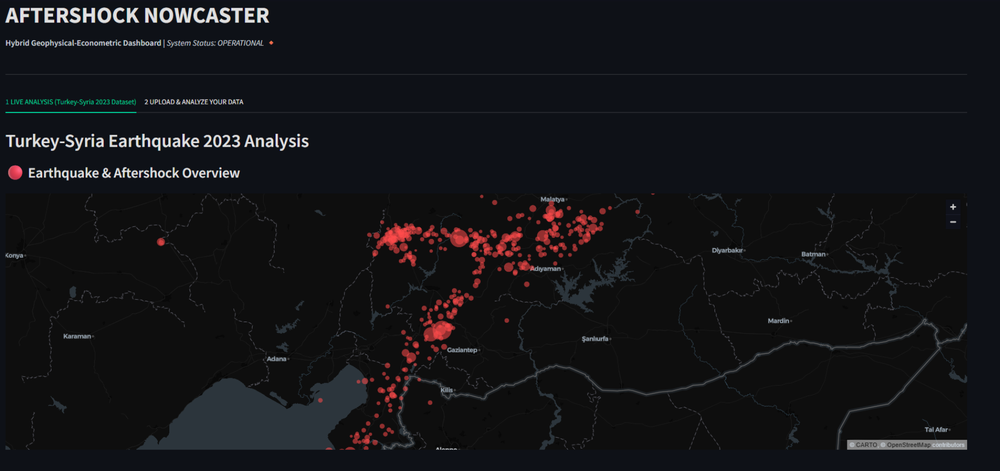
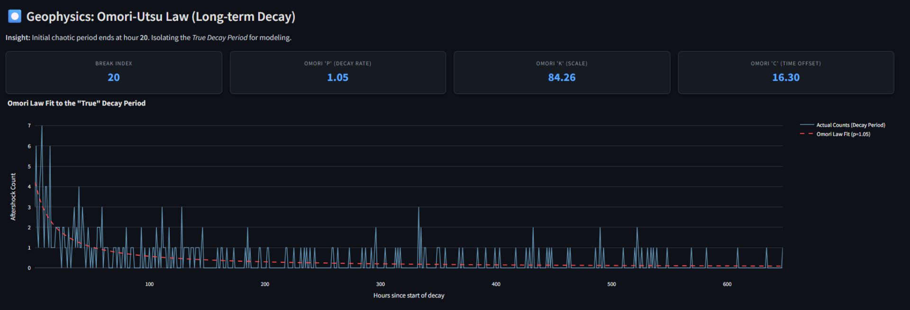
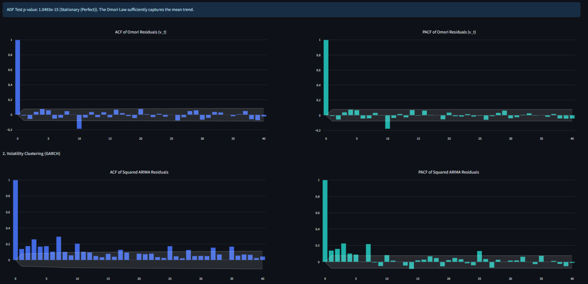
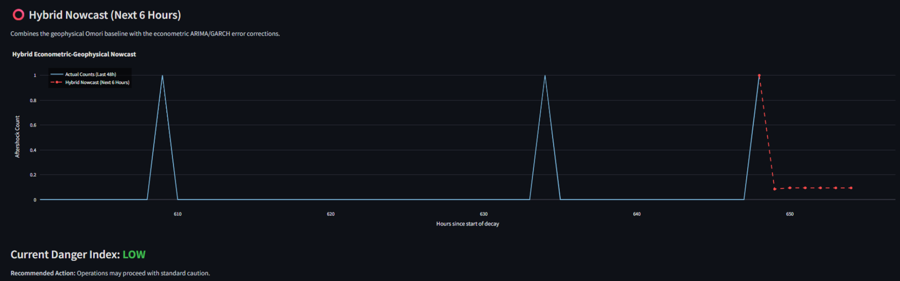
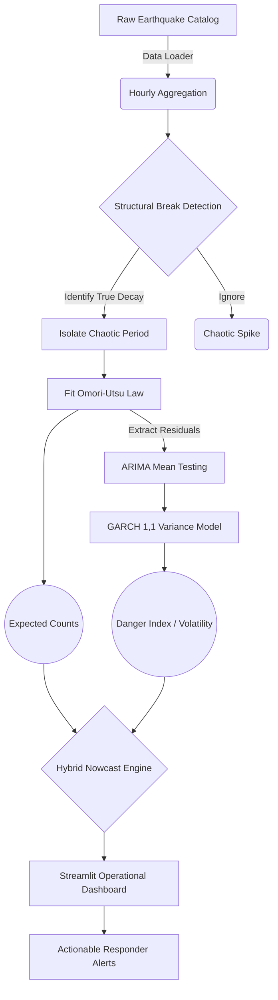

# 🛡️ Aftershock Nowcaster: Hybrid Geophysical-Econometric System


Following a catastrophic earthquake, the sequence of aftershocks often poses a greater threat to damaged infrastructure and rescue operations than the main event itself. **Aftershock Nowcaster** is a highly practical dashboard that produces a short-term risk forecast ("nowcast") by combining canonical geophysics laws with financial econometric volatility models.

---

## 📑 Table of Contents
1. [Dashboard Previews](#-dashboard-previews)
2. [Project Overview](#-project-overview)
3. [Methodological Flow](#-methodological-flow)
4. [Complete Findings](#-complete-findings)
5. [Installation & Usage](#-installation--usage)
6. [Scope & Future Work](#-scope--future-work)
7. [Directory Structure](#-directory-structure)

---

## 📸 Dashboard Previews

### 1. Live Spatial Mapping (Built-in Dataset)

*Interactive 3D heatmap rendering the physical locations and magnitudes of all recorded aftershocks using PyDeck and CartoDB Dark Matter.*

### 2. Geophysics Baseline (Omori-Utsu Decay)

*The geophysical baseline. This plot demonstrates the Omori-Utsu law perfectly capturing the long-term, expected decay rate of the aftershock sequence once the initial chaotic spike is isolated.*

### 3. Econometric Volatility (Residual Analysis)

*Autocorrelation (ACF) and Partial Autocorrelation (PACF) plots of the squared residuals, visualizing the strong, persistent volatility clustering modeled by the GARCH(1,1) algorithm.*

### 4. The Final Hybrid Nowcast

*The culmination of the pipeline: combining the steady Omori decay curve with the GARCH volatility corrections to produce a highly accurate, short-term hybrid forecast.*

---

## 🚀 Project Overview

The system addresses a fundamental operational limitation: The **Omori-Utsu Law**, the canonical model for aftershocks, is excellent at predicting the *long-term expected average decay* of aftershocks over days or weeks. However, it fails to capture short-term clustering and volatility—moments where a sequence temporarily flares up.

To solve this, we extract the errors (residuals) from the Omori baseline and run them through financial econometric models designed to track volatility clustering (ARIMA & GARCH). The result is a **Hybrid Nowcast** that outputs:
1. The **Expected Count** (Workload)
2. The **Danger Index** (Short-term Risk & Volatility)

This dual-metric output allows emergency responders to make highly informed, tactical decisions about when to enter damaged structures.

---

## ⚙️ Methodological Flow

The pipeline is completely automated and "ingestion ready" for live data feeds.



---

## 📊 Complete Findings

Our analysis of the massive **2023 Turkey-Syria sequence (M7.8)** yielded profound operational insights:

1. **The Initial Chaos Must Be Skipped:** Using `ruptures` structural break detection, we found that fitting models to the first ~20 hours of a sequence skews results. The "true decay" only stabilizes after this transient spike passes.
2. **Geophysics Captures the Mean:** Our ARIMA(1,0,0) model revealed a high p-value (~0.665) when run on the Omori residuals. This statistically proves that the Omori Law perfectly captures the predictable *mean* decay of the sequence.
3. **Econometrics Captures the Risk:** Running a GARCH(1,1) model on the residuals revealed massive heteroskedasticity (volatility clustering) with a persistence parameter ($\beta_1 \approx 0.9788$). This proves that **risk is persistent**; a highly volatile hour is extremely likely to be followed by another highly volatile hour.

---

## 💻 Installation & Usage

This project is built to be deployed seamlessly on **Streamlit Cloud**.

### Local Setup
1. Clone the repository:
```bash
git clone https://github.com/yourusername/aftershock-nowcaster.git
cd aftershock-nowcaster
```

2. Install dependencies:
```bash
pip install -r requirements.txt
```

3. Run the Streamlit application:
```bash
streamlit run app.py
```

### Dashboard Features
*   **Tab 1 (Live Analysis):** Runs the full pipeline on the included USGS 2023 Turkey-Syria catalog. Features interactive CartoDB mapping.
*   **Tab 2 (Upload Your Data):** A drag-and-drop interface for users to upload their own `.csv` or `.xlsx` earthquake catalogs. The pipeline instantly adapts and runs the nowcast on the uploaded sequence.

---

## 🔭 Scope & Future Work

The current pipeline lays the groundwork for a globally scalable early-warning dashboard. Future scopes include:

1. **Live Earthquake Data Ingestion:** 
   Our data pipeline is strictly modular and *ingestion ready*. The next step is to connect `src/data_loader.py` directly to the USGS live JSON API endpoints to produce real-time nowcasts without manual CSV uploads.
2. **Advanced Model Architectures:** 
   - **Asymmetric Volatility:** Implementing GJR-GARCH to test if large "shock" events skew future risk differently than smaller tremors.
   - **Machine Learning Integration:** Combining the current econometric errors with LSTM or Transformer neural networks to capture non-linear persistence patterns.
3. **Global Multi-Fault Study:** 
   The current application serves as a case study for the 2023 Turkey quake. Future iterations will test the model across multiple historic, geographically distinct sequences (e.g., Japan 2011, Chile 2010, California 1989) to build a universally generalized hyper-parameter set.
4. **Spatial Contagion:** 
   Implementing Multivariate GARCH to model how volatility in one fault zone transfers and "infects" neighboring fault zones.

---

## 📁 Directory Structure

```text
├── .git/                        # Git history tracking
├── src/                         # Modular Source Code
│   ├── data_loader.py           # Catalog parsing & hourly aggregation
│   ├── model_geophysics.py      # Ruptures break detection & Omori fitting
│   ├── model_econometrics.py    # ARIMA & GARCH volatility modeling
│   └── visualization.py         # Interactive Plotly chart generators
├── images/                      # Dashboard screenshot assets
├── Turkey_Aftershops_2023.csv.csv # Built-in USGS Catalog (Turkey-Syria)
├── app.py                       # Main Streamlit Dashboard Entrypoint
├── requirements.txt             # Python dependencies for Streamlit Cloud
└── README.md                    # Project documentation
```

---
*Disclaimer: This dashboard provides probabilistic forecasts based on statistical persistence. It should be used as a guiding danger index in conjunction with official seismological warnings, not as an absolute physical predictor.*
